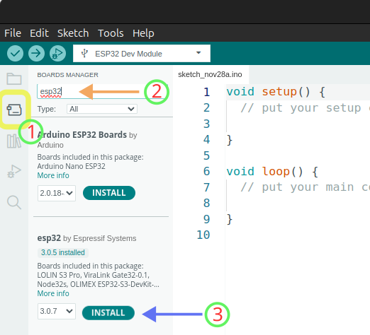

# Instalación de Micro-ROS en Arduino IDE - Uso en ESP32

En este tutorial se han recopilado los pasos necesarios para la instalación y configuración de micro-ROS usando la librería de micro-ros-arduino y Arduino IDE. A continuación se muestra el contenido de este repositorio:

- [Descarga de Arduino IDE y configuración para uso de ESP32](#descarga-de-arduino-ide-y-configuración-para-uso-de-esp32)
- [Añadir librerías de micro-ROS a arduino](#añadir-librerías-de-micro-ros-a-arduino)
- [Prueba de la librería micro-ros-arduino](#prueba-de-la-librería-micro-ros-arduino)
- [Creación del espacio de trabajo de micro-ROS](#creación-del-espacio-de-trabajo-de-micro-ros)
- [Creación del agente micro-ROS](#creación-del-agente-micro-ros)
- [Ejecutar el agente de micro-ROS](#ejecutar-el-agente-de-micro-ros)
- [Creación del workspace del firmware (opcional)](#creación-del-workspace-del-firmware---opcional)
  - [Construcción de firmware](#construcción-de-firmware)
- [Creación de mensajes personalizados](#creación-de-mensajes-personalizados)
  - [Instalación de docker](#instalación-de-docker)
  - [Creación del mensaje personalizado](#creación-del-mensaje-personalizado)
  - [Uso del mensaje personalizado en Arduino-IDE](#uso-del-mensaje-personalizado-en-arduino-ide)
  
## Descarga de Arduino-IDE y configuración para uso de ESP32
La descarga de Arduino-IDE para Ubuntu se puede hacer desde la [página oficial](https://www.arduino.cc/en/software). De las opciones de descarga puede seleccionar la que dice __Linux__ AppImage 64 bits (X86-64). 

Una vez descargado, debería de aparecer en el directorio `Descargas` el archivo `arduino-ide_<versión>_Linux_64bit.AppImage`. Ahora será necesario mover este archivo a un directorio que se coloque en la `carpeta personal`, para ello puedes ejecutar las siguientes instrucciones en una terminal:

```
mkdir ~/Arduino
```
Y para copiar el archivo de Arduino-IDE puedes ejecutar:
```
mv ~/Descargas/arduino-ide_<versión>_Linux_64bit.AppImage ~/Arduino/
```
Antes de ejecutar Arduino-IDE será necesario establecerlo como programa. Para darle este permiso, ve a la carpeta `Arduino` y da clic derecho sobre el archivo `arduino-ide_<versión>_Linux_64bit.AppImage` y selecciona la opción `Propiedades`, si estás en ubuntu 24.04 hasta abajo de esta nueva ventana aparecerá la opción `Ejecutable como un programa`, actívala y guarda los cambios. Si todo está bien en el sistema será suficiente con dar doble clic sobre el archivo y se abrirá el IDE. En caso de que no se abra, es probable que haga falta la instalación de un paquete en Ubuntu. Puedes probar el siguiente comando para instalarlo si estás en __Ubuntu 24.04__:

```
sudo apt install libfuse2
```

Con lo anterior debería ser posible ejecutar Arduino-IDE. Por último, para poder usar la ESP32 es necesario descargar la información de la tarjeta en el IDE. Para hacerlo, en la barra lateral izquierda, selecciona la opción `Boards manager` y sigue los pasos que se muestran en la imagen. __NOTA IMPORTANTE__: La versión 2.0.3 a 3.0.7 no ha funcionado del todo bien con las librerías de micro-ros-arduino, especialmente al modificar la frecuencia cuando se crea un `timer_callback` para el publisher. Al aumentar la frecuencia usando estas librerías pareciera tener un tope de 1 Hz. Para evitar este comportamiento se [recomienda instalar la versión 2.0.2](https://www.reddit.com/r/ROS/comments/1fbqk5i/comment/lvrtrwd/?utm_source=share&utm_medium=web3x&utm_name=web3xcss&utm_term=1&utm_content=share_button):

<p align="center">

</p>

Después de instalar esta versión de la librería, se debe correr el siguiente comando para que no haya problema con las librerías de python:

```
sudo ln -s /usr/bin/python3 /usr/bin/python
```

## Añadir librerías de micro-ROS a arduino

Para ello descarga las librerías del siguiente repositorio: https://github.com/micro-ROS/micro_ros_arduino/releases
Si tienes instalada la versión jazzy, no hay inconveniente en instalar la versión para iron (aparece como la v2.0.7-iron). Descarga el archivo que aparece con el nombre __Source code (zip)__.

Posteriormente, abre el IDE de Arduino, ve a __Sketch > Include Library > Add .ZIP Library__ y selecciona la librería que acabas de descargar (micro_ros_arduino-2.0.7-iron.zip).

## Prueba de la librería micro-ros-arduino
Prueba cargando algún ejemplo en la ESP32. Para probar el Wi-Fi, usa el que se llama __micro-ros_publisher_wifi__. 

Dentro del __void setup__ encontrarás lo siguiente:

```
void setup() {
  // Para comunicación vía Wi-Fi se usa la siguiente función
  set_microros_wifi_transports("WIFI SSID", "WIFI PASS", "192.168.1.57", 8888);

 // Para comunicación serial solamente, se utiliza la siguiente línea y se comenta la anterior.
 // set_microros_transports();

  pinMode(LED_PIN, OUTPUT);
  digitalWrite(LED_PIN, HIGH);

  delay(2000);

  allocator = rcl_get_default_allocator();

  //create init_options
  RCCHECK(rclc_support_init(&support, 0, NULL, &allocator));

  // create node
  RCCHECK(rclc_node_init_default(&node, "micro_ros_arduino_wifi_node", "", &support));

  // create publisher
  RCCHECK(rclc_publisher_init_best_effort(
    &publisher,
    &node,
    ROSIDL_GET_MSG_TYPE_SUPPORT(std_msgs, msg, Int32),
    "topic_name"));

  msg.data = 0;
}
```

Para configurar la conexión de la ESP32 a Wi-Fi, coloca los datos de la red en los espacios que dicen `WIFI SSID` y `WIFI PASS`. En el primero coloca el nombre de la red y en el segundo la contraseña.

En el tercer campo debes colocar la ip de la computadora que está corriendo el agente de micro-ROS. Para obtener la ip, puedes usar el siguiente comando en una terminal:
```
hostname -I
```
El cuarto elemento sirve para colocar el puerto por el cual se realiza la comunicación. 

Las demáslíneas sirven para configurar otros aspectos del nodo, tales como el nombre del nodo, la creación del publisher, la definición del tipo de dato y el nombre del tópico.

El programa anterior, funciona solamente si el ROS-DOMAIN-ID es 0. Si el ID es diferente entonces la configuración en el `void setup()` quedaría de la siguiente manera

```
void setup() {
   // Para comunicación vía Wi-Fi se usa la siguiente función
  set_microros_wifi_transports("WIFI SSID", "WIFI PASS", "192.168.1.57", 8888);

  // Para comunicación serial solamente, se utiliza la siguiente línea y se comenta la anterior.
  // set_microros_transports();

  // Next two lines could be removed
  pinMode(LED_PIN, OUTPUT); 
  digitalWrite(LED_PIN, HIGH);

  delay(2000);

  allocator = rcl_get_default_allocator();
  
  // Create init_options
  rcl_init_options_t init_options = rcl_get_zero_initialized_init_options();

  // Set your domain_id
  size_t domain_id = 2;

  RCCHECK(rcl_init_options_init(&init_options, allocator));

  RCCHECK(rcl_init_options_set_domain_id(&init_options, domain_id));

  //create init_options
  RCCHECK(rclc_support_init_with_options(&support, 0, NULL, &init_options, &allocator));

  // create node
  RCCHECK(rclc_node_init_default(&node, "micro_ros_arduino_wifi_node", "", &support));

  // create publisher
  RCCHECK(rclc_publisher_init_best_effort(
    &publisher,
    &node,
    ROSIDL_GET_MSG_TYPE_SUPPORT(std_msgs, msg, Int32),
    "prueba"));

  msg.data = 0;
}
```

## Creación del espacio de trabajo de micro-ROS

La creación del espacio de trabajo para micro-ROS se realizó utilizando los pasos de [este tutorial](https://micro.ros.org/docs/tutorials/core/first_application_rtos/freertos/). Sin embargo, hay un ligero cambio en el nombre del directorio del espacio de trabajo, ya que en el tutorial se nombra como __microros_ws__, y en nuestro caso lo llamaremos __uros_ws__. Este cambio se realizó debido a que es necesario para la compilación de las librerías de micro_ros_arduino en caso de que se creen nuevas interfaces (mensajes y servicios). 

```
# Source the ROS 2 installation
source /opt/ros/$ROS_DISTRO/setup.bash

# Create a workspace and download the micro-ROS tools
mkdir uros_ws
cd uros_ws
git clone -b $ROS_DISTRO https://github.com/micro-ROS/micro_ros_setup.git src/micro_ros_setup

# Update dependencies using rosdep
sudo apt update && rosdep update
rosdep install --from-paths src --ignore-src -y

# Install pip
sudo apt-get install python3-pip

# Build micro-ROS tools and source them
colcon build
source install/local_setup.bash
```


## Creación del agente micro-ROS

```
# Download micro-ROS-Agent packages
ros2 run micro_ros_setup create_agent_ws.sh

# Build step
ros2 run micro_ros_setup build_agent.sh
source install/local_setup.bash
```

## Ejecutar el agente de micro-ROS
Para realizar una conexión vía Wi-Fi, usando el protocolo UDP4 se debe ejecutar la siguiente instrucción:
```
ros2 run micro_ros_agent micro_ros_agent udp4 --port 8888
```
El puerto de enlace debe ser el mismo configurado en el transport de Arduino. 

Por otra parte, para una ejecución vía serial, se debe ejecutar la siguiente instrucción:
```
ros2 run micro_ros_agent micro_ros_agent serial --dev /dev/ttyUSBx
```
donde `x` corresponde al ID del dispositivo. Para verificar qué ID tiene se puede revisar en Arduino -IDE o también puedes visualizarlo con el comando 
```
ls /dev/ttyUSB*
```
Para ello la ESP32 debe estar conectada a la computadora. Si tienes diferentes dispositivos USB, prueba desconectar el que interesa, ejecuta el comando anterior, y verificar cuál desaparece. Con lo anterior sabrás qué puerto escoger.

## Creación del workspace del firmware - opcional
En caso de que se requiera programar la ESP32 directamente en micro-ros, es necesario instalar el ESP-IDF antes de cualquier otra cosa, para ello, sigue los pasos de este [tutorial](https://docs.espressif.com/projects/esp-idf/en/stable/esp32/get-started/linux-macos-setup.html)

Una vez instalado, procede a crear el firmware para ESP32. Para ello deberás estar en el directorio del espacio de trabajo de micro-ros, es decir `~/uros_ws/` y ejecutar el siguiente comando:
```
ros2 run micro_ros_setup create_firmware_ws.sh freertos esp32
```
### Construcción de firmware

```
# Build step
ros2 run micro_ros_setup build_firmware.sh
source install/local_setup.bash
```

## Creación de mensajes personalizados 
Para la creación de un mensaje personalizado se deben seguir los pasos mencionados en [esta guía](https://docs.ros.org/en/jazzy/Tutorials/Beginner-Client-Libraries/Custom-ROS2-Interfaces.html). También es necesario que se tengan en cuenta [estas consideraciones](https://docs.ros.org/en/jazzy/Concepts/Basic/About-Interfaces.html#field-names) al definir el nombre del mensaje. El paquete que se debe crear es preferible colocarlo en el espacio de trabajo de ROS2, normalmente llamado `/ros2_ws`.

Al finalizar el tutorial, en el ambiente de ROS2 debería aparecer el mensaje personalizado. Para verificar, simplemente ejecuta el siguiente comando:
```
 ros2 interface list --only-msgs
```

Esto entrega la siguiente salida:
```
...
map_msgs/msg/PointCloud2Update
map_msgs/msg/ProjectedMap
map_msgs/msg/ProjectedMapInfo
micro_ros_msgs/msg/Entity
micro_ros_msgs/msg/Graph
micro_ros_msgs/msg/Node
my_custom_message/msg/Joints  
my_custom_message/msg/MyCustomMessage
nav_msgs/msg/GridCells
nav_msgs/msg/MapMetaData
nav_msgs/msg/OccupancyGrid
nav_msgs/msg/Odometry
nav_msgs/msg/Path
pcl_msgs/msg/Model
...
```
Para este caso particular, se tienen dos nuevos mensajes personalizados, el primero llamado `my_custom_message/msg/Joints` y el segundo `my_custom_message/msg/MyCustomMessage`.

El siguiente paso es crear estos mensajes para micro_ros_arduino. Para ello primero es necesario instalar __Docker__. 
### Instalación de docker

Para recompilar las librerías de micro-ROS y las interfacez de ROS2 en el IDE de arduino se debe instalar docker con el siguiente comando:

```
sudo snap install docker
```
### Creación del mensaje personalizado

Una vez que se tiene el paquete del nuevo mensaje en ROS2, es suficiente con copiar ese directorio a la ruta `~/Arduino/libraries/micro_ros_arduino/`. Esto se puede hacer desde el explorador de archivos o por medio de la terminal:

```
scp -r /home/<user>/ros2_ws/src/<package_name>/ /home/<user>/Arduino/libraries/micro_ros_arduino/extras/library_generation/extra_packages/
```
Ahora, se procede a compilar las librerías para ser usadas en Arduino-IDE:
```
cd ~/Arduino/libraries/micro_ros_arduino/

sudo docker pull microros/micro_ros_static_library_builder:jazzy
sudo docker run -it --rm -v $(pwd):/project --env MICROROS_LIBRARY_FOLDER=extras microros/micro_ros_static_library_builder:jazzy -p esp32
```

Con lo anterior ya deberían aparecer las librerías compiladas en Arduino IDE. Para revisar que existen los paquetes en Arduino, puede abrirse el archivo `available_ros2_types.txt`, el cual se encuentra en la ruta `~/Arduino/libraries/micro_ros_arduino/`. 
```
...
lifecycle_msgs/Transition.msg
lifecycle_msgs/TransitionDescription.msg
lifecycle_msgs/TransitionEvent.msg
my_custom_message/Joints.msg
my_custom_message/MyCustomMessage.msg
nav_msgs/GetMap.srv
nav_msgs/GetPlan.srv
nav_msgs/GridCells.msg
nav_msgs/LoadMap.srv
nav_msgs/MapMetaData.msg
...
```
En este caso aparecerán también los mensajes como en el caso del ambiente de ROS2, `my_custom_message/Joints.msg` y `my_custom_message/MyCustomMessage.msg`. 
### Uso del mensaje personalizado en Arduino-IDE

Es recomendable reiniciar Arduino-IDE en caso de que se esté utilizando la versión 2.0 o superior y que se tenga habilitada la opción de sugerencia de comandos. Una vez dentro de Arduino-IDE, en el preámbulo del proyecto se deberá incluir la nueva librería, se tendría algo como lo siguiente:
```
#include <micro_ros_arduino.h>

#include <stdio.h>
#include <rcl/rcl.h>
#include <rcl/error_handling.h>
#include <rclc/rclc.h>
#include <rclc/executor.h>
#include <my_custom_message/msg/joints.h>
 ```

Nótese que el nombre del tipo de mensaje se coloca todo en minúsculas y al final se coloca `.h`. Siempre será así cuando incluyan las librerías, mientras que para crear una variable con ese tipo de dato, sí se respetarán las mayúsculas que aparezcan en los nombres:

```
rcl_subscription_t subscriber;
rcl_publisher_t publisher;
rclc_executor_t executor;
rclc_support_t support;
rcl_allocator_t allocator;
rcl_node_t node;
rcl_timer_t timer;


my_custom_message__msg__Joints q;
```
Otro detalle importante son las separaciones entre el nombre del paquete, el directorio msg y el tipo de dato, en este caso, se ocupan dos guiones bajos '_'.  
